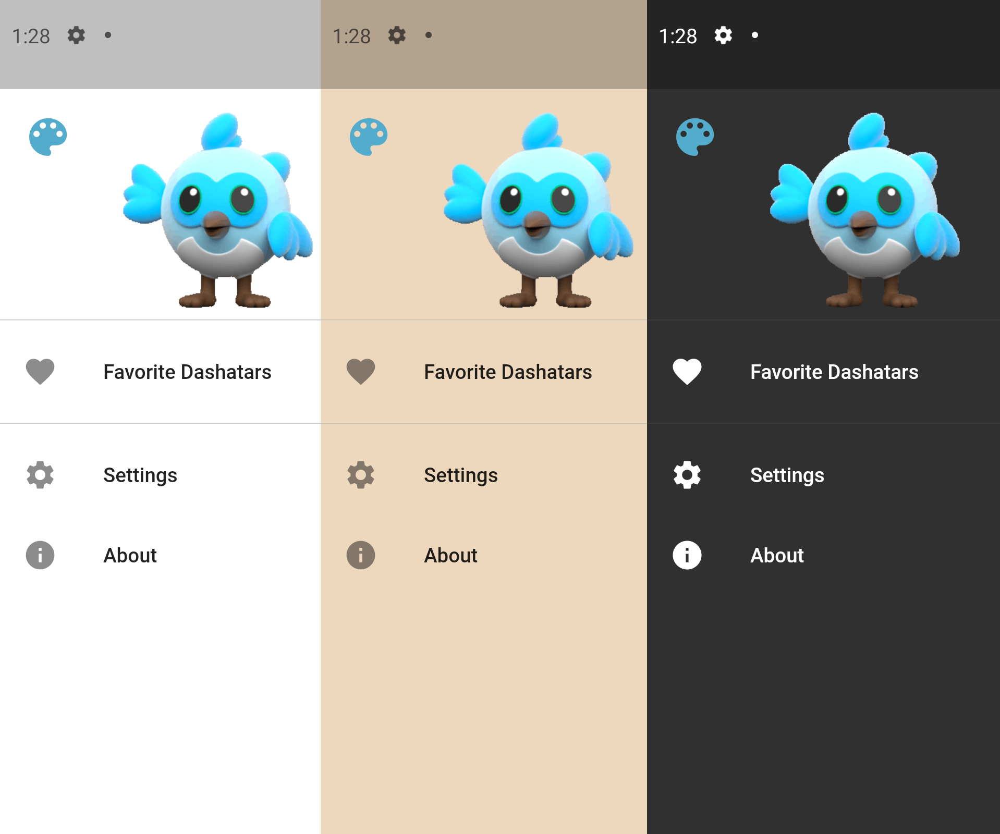
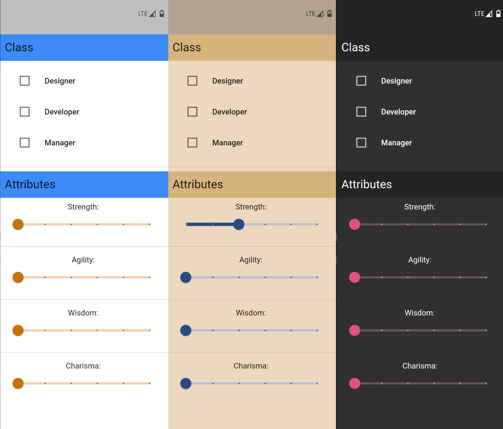
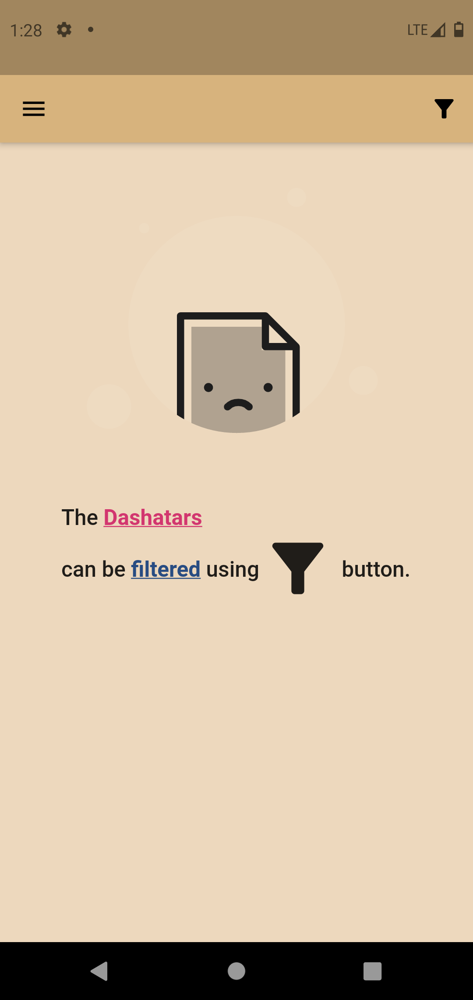
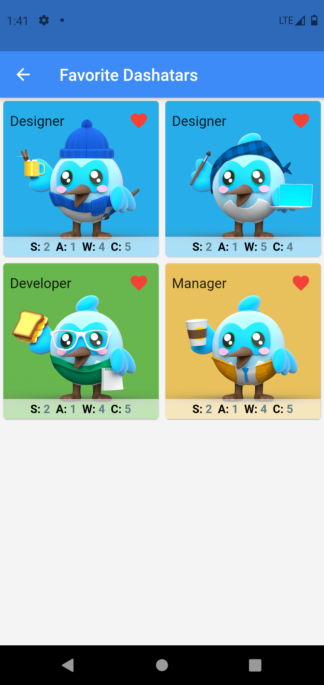
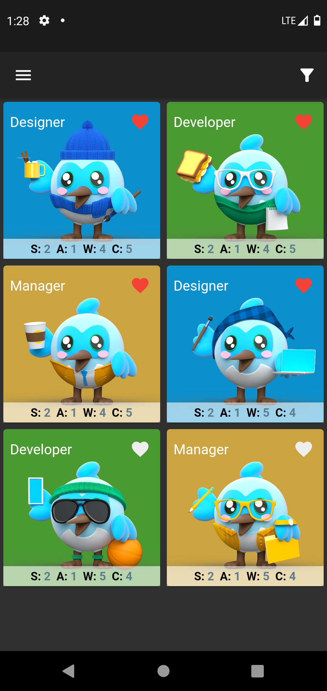

# blab_dashatar


It must be confessed that I tried out different Dashatars by playing with attributes, and I wanted to know what Dashatar will be created. :D

As a result of that, this project has been made. This application lets you retrieve all dashatars by `filtering` them. It is also possible to make a `favorite list` out of them and `download` the desired image for future use.

This project is for [#30DaysOfFlutter][twitterhashtag].

You can download it on the release section.

[twitterhashtag]: https://twitter.com/hashtag/30daysofflutter

## Getting Started

Take the project and unzip it, remove `-master` at the end of the directory and then go into the folder.

In order to run the project, you need to first install packages.

```bash
flutter packages get
```

Then run the project.

```bash
flutter run
```

# Screenshots

> If you would like to see the photos in larger sizes just click on them.

</br>

<a href="doc_resources/screenshots/drawer.png">
</a>

<a href="doc_resources/screenshots/end_drawer.png">
</a>

<a href="doc_resources/screenshots/empty.png">
</a>
<a href="doc_resources/screenshots/favorite.png">
</a>
<a href="doc_resources/screenshots/home.png">
</a>

This is the app in action!

[Video](doc_resources/screenshots/video.mp4)


# Credits

A minimalist icon variation and a dashatar icon have been created, I have set the minimal one as the default icon, you can try either one.

Images of the other icon and the original graphic asset are located in `graphics` directory. They were made using awesome [gravit-designer](designer.gravit.io).

I `do NOT require` attribution for your use/modification/etc of my gravit/icons files.

## Others

- [Dashatar](dashatar-dev.web.app/)
- [empty_state Animation](https://flare.rive.app/a/rablex/files/flare/empty_state)
- [time-read Animation](https://flare.rive.app/a/Tatyana/files/flare/time-read)
- [teddy Animation](https://flare.rive.app/a/JuanCarlos/files/flare/teddy)
